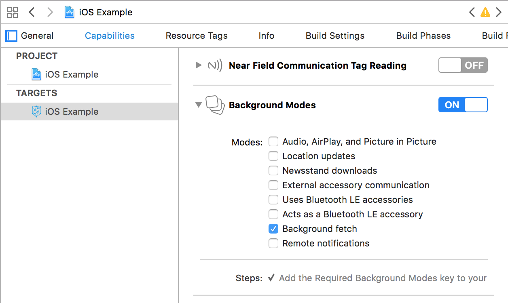

# Locarta iOS SDK

| Latest Version | Size | Requirements | Release Date
| ------------- |  ------------- | -------------  | -------------
| 1.0.0 | TBD | iOS 8.0+ | TBD

## Setup
------

### Installation

#### Cocoapods

Add the following line in your podfile and run `pod install`:

```ruby
pod 'LocartaSDK'
```

### Update `Info.plist`

Add appropriate location usage descriptions to the Info.plist of your application. Do not forget to replace `[APP_NAME]` with your app's name:

```xml
<key>NSLocationAlwaysUsageDescription</key>
<string>[APP_NAME] would like to access location.</string>
<key>NSLocationWhenInUseUsageDescription</key>
<string>[APP_NAME] would like to access location.</string>
<key>NSLocationAlwaysAndWhenInUseUsageDescription</key>
<string>[APP_NAME] would like to access location.</string>]
```

### Enable background fetch in your project



Implement the following method in your `AppDelegate`:

```swift
func application(_ application: UIApplication,
                 performFetchWithCompletionHandler completionHandler: @escaping (UIBackgroundFetchResult) -> Void) {
	LocartaSDK.shared.performFetchWithCompletionHandler(completionHandler)
}
```

### Obtain user opt-in

The SDK will not start working until the user has opted in – this needs to be done only once per user. You can do this via the SDK's method:

```swift
LocartaSDK.shared.setAgreementAccepted(isAccepted: true)
```

### Initialise the SDK

Implement the following method in your `AppDelegate` and replace `YOUR_PUBLISHER_ID` with your Locarta publisher id:

```swift
func application(_ application: UIApplication,
                 didFinishLaunchingWithOptions launchOptions: [UIApplicationLaunchOptionsKey: Any]?) -> Bool {
    try? LocartaSDK.shared.initialize(configuration: SdkConfiguration(publisherId: "YOUR_PUBLISHER_ID"))
    return true
}
```
